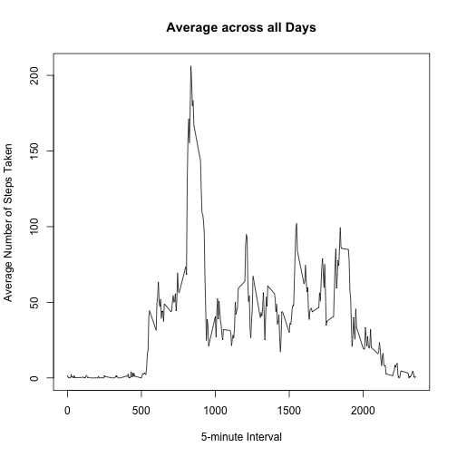

## Loading and preprocessing the data

```r
library(data.table)
library(shiny)
library(ggplot2)
library(dplyr)
library(tidyr)
library(lattice)
df <- read.csv("activity.csv")
```
## What is mean total number of steps taken per day?
Use aggregate() to make a new datatable with date v.s. total steps

```r
total_steps <- aggregate(steps ~ date, FUN = sum, data = df)
```

The histogram of total steps per day

 

There mean and median of total number of steps per day:

```r
mean(total_steps$steps)
```

```
## [1] 10766.19
```

```r
median(total_steps$steps)
```

```
## [1] 10765
```
## What is the average daily activity pattern?
Use the summarize() function to create a new datatable interval v.s. steps:

```r
tmp <- summarize(group_by(df, interval), mean(steps, na.rm = T))
```
Average daily activity

 

Using summary(), find the maximum number of steps. Use the result to find the row containing maximum number of steps.

```r
summary(tmp)
```

```
##     interval      mean(steps, na.rm = T)
##  Min.   :   0.0   Min.   :  0.000       
##  1st Qu.: 588.8   1st Qu.:  2.486       
##  Median :1177.5   Median : 34.113       
##  Mean   :1177.5   Mean   : 37.383       
##  3rd Qu.:1766.2   3rd Qu.: 52.835       
##  Max.   :2355.0   Max.   :206.170
```

```r
filter(tmp, tmp$`mean(steps, na.rm = T)` > 206)
```

```
## Source: local data frame [1 x 2]
## 
##   interval mean(steps, na.rm = T)
##      (int)                  (dbl)
## 1      835               206.1698
```

## Imputing missing values
Use summary() to find out how many rows contains missing values(NA)

```r
summary(df)
```

```
##      steps                date          interval     
##  Min.   :  0.00   2012-10-01:  288   Min.   :   0.0  
##  1st Qu.:  0.00   2012-10-02:  288   1st Qu.: 588.8  
##  Median :  0.00   2012-10-03:  288   Median :1177.5  
##  Mean   : 37.38   2012-10-04:  288   Mean   :1177.5  
##  3rd Qu.: 12.00   2012-10-05:  288   3rd Qu.:1766.2  
##  Max.   :806.00   2012-10-06:  288   Max.   :2355.0  
##  NA's   :2304     (Other)   :15840
```
--> missing value = 2304 rows

Replace NA with mean for that 5-minute interval, write the result to a tidy file called padded.csv


```r
new <- replace_na(df, replace = list(steps = tmp$'mean(steps, na.rm = T)'))
write.csv(new, "padded.csv", row.names = F)
```

Histogram of total number of steps take each day

 


```r
mean(tmp$steps)
```

```
## [1] 10766.19
```

```r
median(tmp$steps)
```

```
## [1] 10766.19
```
## Are there differences in activity patterns between weekdays and weekends?

Use wday() and bind_cols() to create a new column weekdays

```r
library(lubridate)
x <- sub('2', 'weekday',
        sub('3', 'weekday',
            sub('4', 'weekday',
                sub('5', 'weekday',
                    sub('6', 'weekday',
                        sub('7', 'weekend', 
                            sub('1', 'weekend',
                                wday(new$date))))))))
weekdays <- bind_cols(new, data.table(weekdays = x))
```


```r
head(weekdays)
```

```
## Source: local data frame [6 x 4]
## 
##       steps       date interval weekdays
##       (dbl)     (fctr)    (int)    (chr)
## 1 1.7169811 2012-10-01        0  weekday
## 2 0.3396226 2012-10-01        5  weekday
## 3 0.1320755 2012-10-01       10  weekday
## 4 0.1509434 2012-10-01       15  weekday
## 5 0.0754717 2012-10-01       20  weekday
## 6 2.0943396 2012-10-01       25  weekday
```

Calculate average steps based on weekday(group1) or weekend(group2) first and combine them back together.


```r
group1 <- filter(weekdays, weekdays == "weekday")
b1 <- aggregate(steps ~ interval, FUN = mean, data = group1) %>%
  mutate(weekdays = "weekday")
group2 <- filter(weekdays, weekdays == "weekend")
b2 <- aggregate(steps ~ interval, FUN = mean, data = group2) %>%
  mutate(weekdays = "weekend")
AvgByTypeOfDays <- bind_rows(b1,b2)
```

Comparing weekdays and weekend

 
